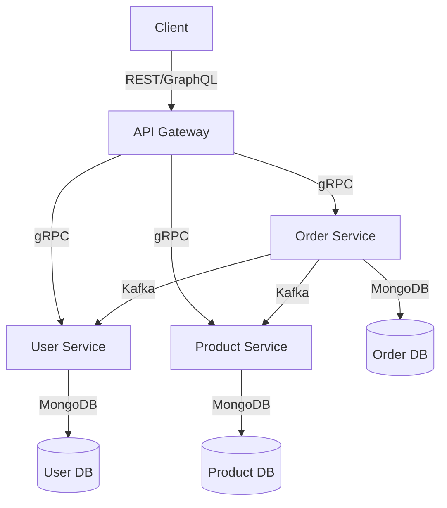
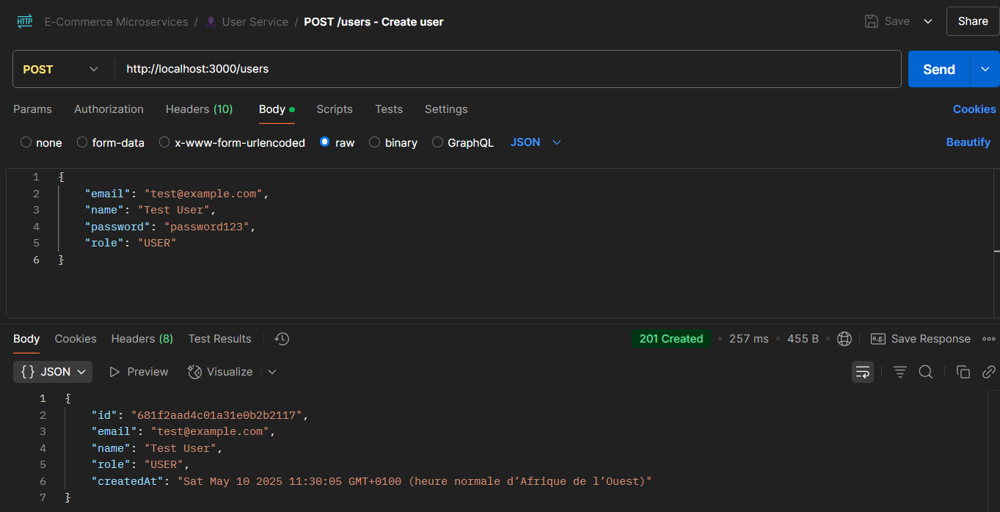
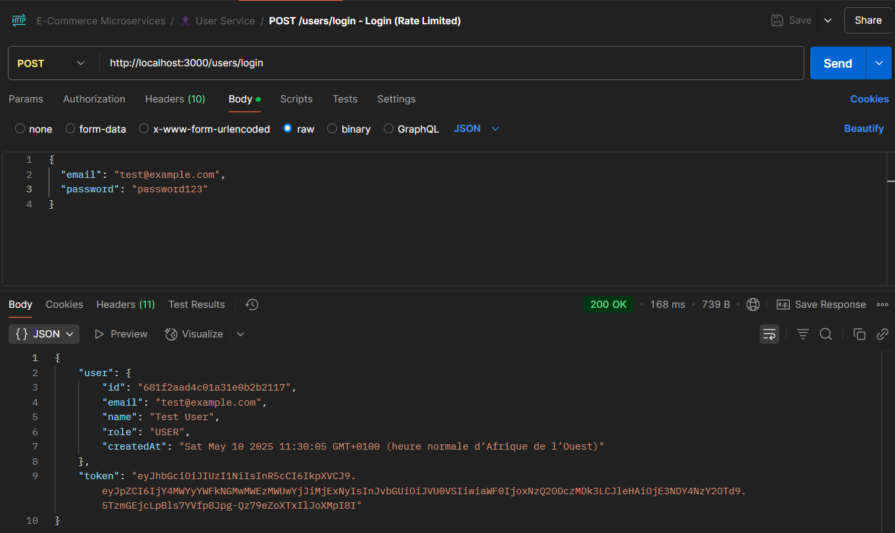
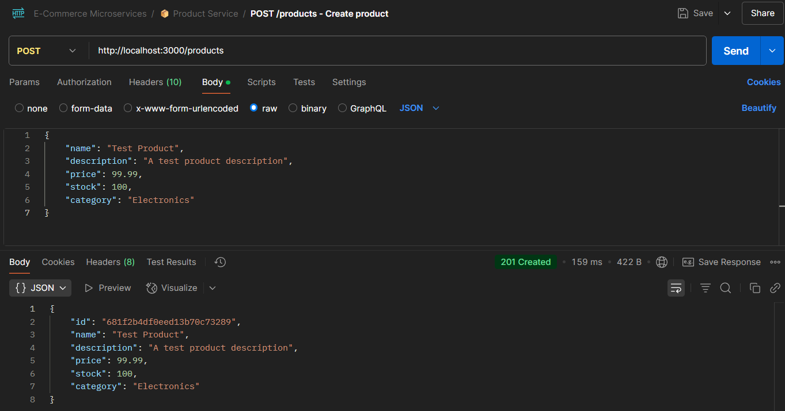
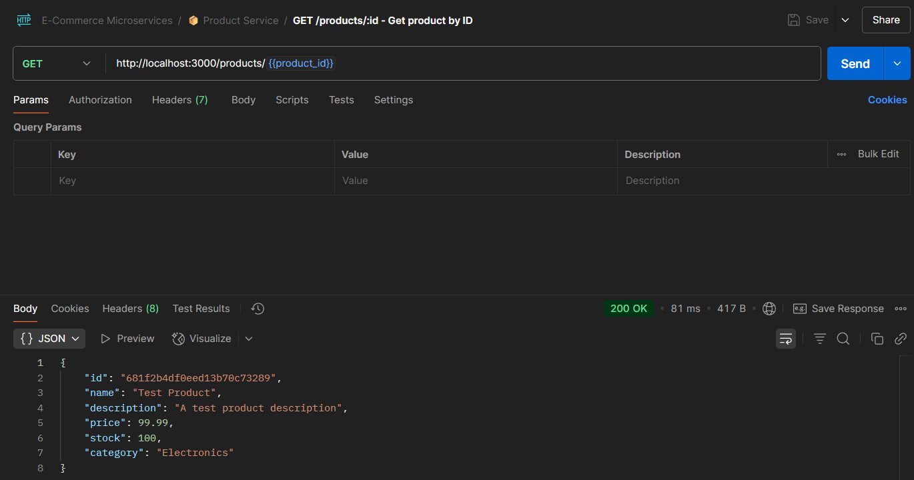
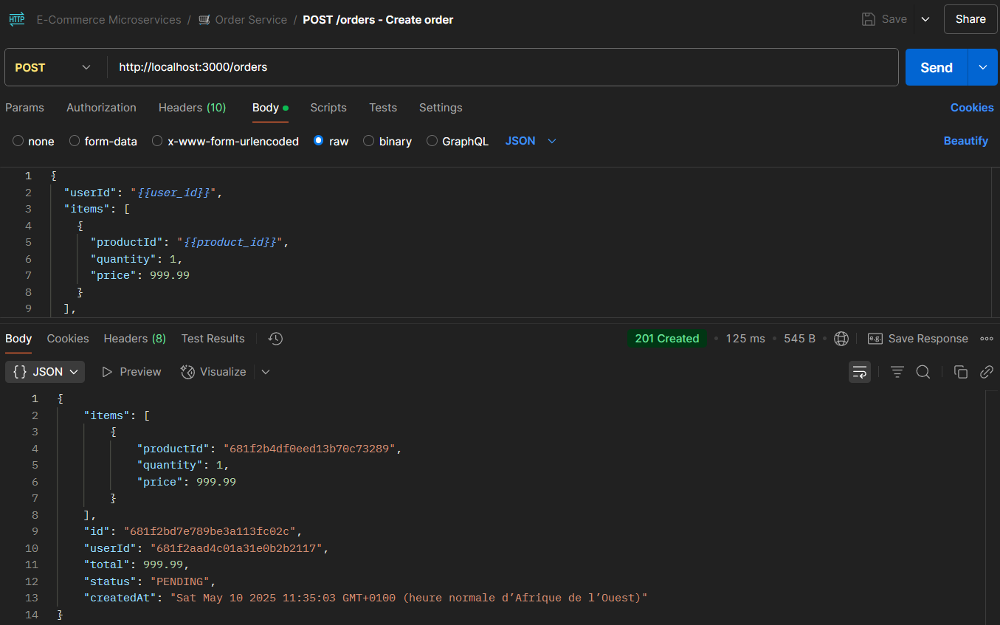
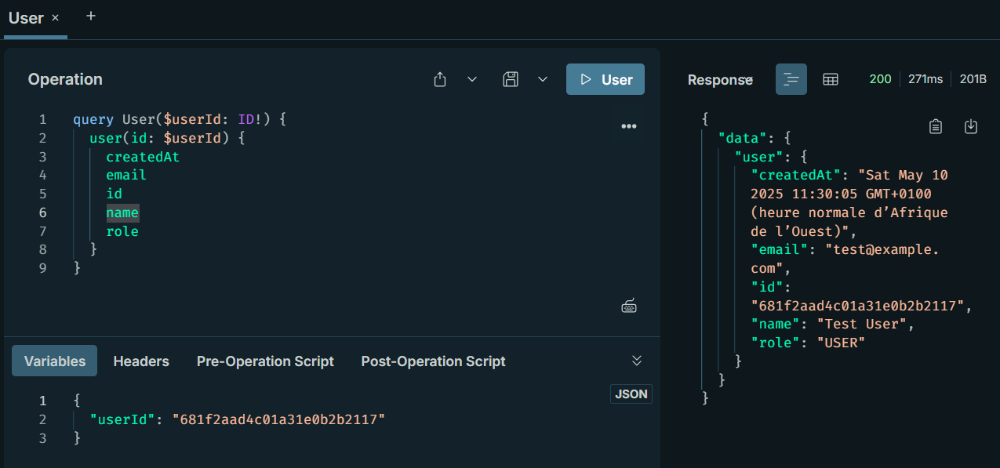
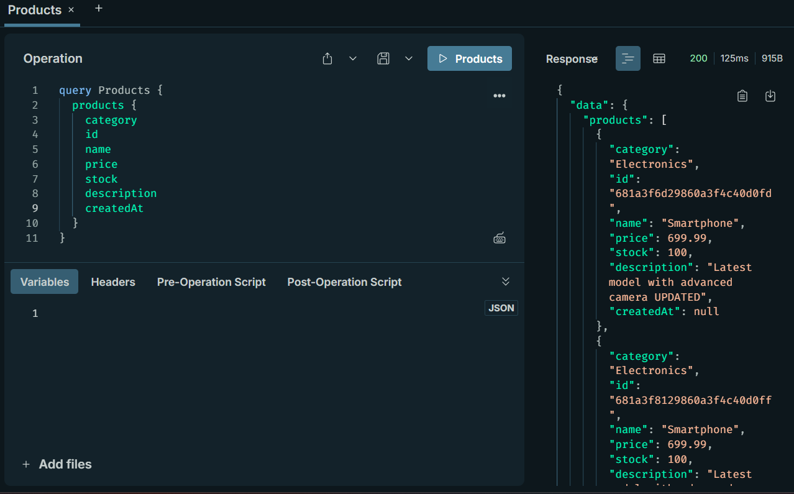
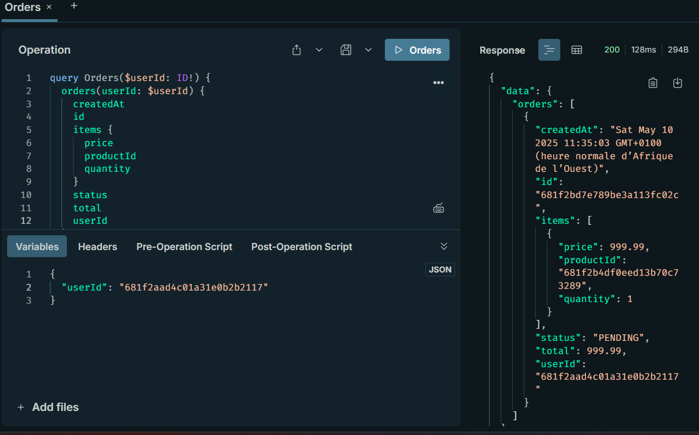

# E-Commerce Microservices & DevOps Project Documentation

## Table of Contents

1. [Project Overview](#project-overview)
2. [System Architecture](#system-architecture)
3. [Technology Stack](#technology-stack)
4. [Project Structure](#project-structure)
5. [Setup & Installation](#setup--installation)
6. [API Documentation](#api-documentation)
7. [Testing](#testing)
8. [DevOps Implementation](#devops-implementation)
9. [Future Roadmap](#future-roadmap)

## Project Overview

### Purpose

This e-commerce microservices project is designed to provide a scalable, maintainable, and high-performance online shopping platform. The system is built using a microservices architecture to ensure loose coupling, independent deployment, and better resource utilization.

### Core Functionality

- User authentication and authorization
- Product catalog management
- Order processing and management
- Real-time inventory tracking
- Secure payment processing

### Key Features

- GraphQL API for flexible data querying
- gRPC for high-performance service communication
- JWT-based authentication
- Rate limiting for API protection
- Event-driven architecture using Kafka
- MongoDB for data persistence

## System Architecture

### Architecture Diagram



### Communication Flows

1. **Client to Gateway**: REST/GraphQL requests
2. **Gateway to Services**: gRPC for internal communication
3. **Service to Service**: Kafka for event-driven communication
4. **Services to Database**: Direct MongoDB connections

### Data Flow

1. Client requests are received by the API Gateway
2. Gateway authenticates requests using JWT
3. Requests are routed to appropriate microservices
4. Services process requests and communicate via gRPC/Kafka
5. Data is persisted in MongoDB databases
6. Responses are returned to clients through the Gateway

## Technology Stack

### Application Stack

| Component       | Technology         | Version | Purpose               |
| --------------- | ------------------ | ------- | --------------------- |
| API Gateway     | Apollo Server      | 4.12.0  | GraphQL API Gateway   |
| API Gateway     | Express            | 5.1.0   | HTTP Server           |
| User Service    | gRPC               | 1.13.3  | Service Communication |
| Product Service | gRPC               | 1.13.3  | Service Communication |
| Order Service   | gRPC               | 1.13.3  | Service Communication |
| Database        | MongoDB            | 8.14.1  | Data Persistence      |
| Authentication  | JWT                | 9.0.2   | Token-based Auth      |
| Security        | bcryptjs           | 3.0.2   | Password Hashing      |
| Message Broker  | Kafka              | 2.2.4   | Event Streaming       |
| API Security    | express-rate-limit | 7.5.0   | Rate Limiting         |

### DevOps Stack

| Component          | Technology        | Purpose                              |
| ------------------ | ----------------- | ------------------------------------ |
| Containerization   | Docker            | Application containerization         |
| Orchestration      | Kubernetes        | Container orchestration & management |
| CI/CD              | Jenkins           | Continuous integration & deployment  |
| Container Registry | Docker Hub        | Docker image storage & distribution  |
| Security Scan      | Trivy             | Container vulnerability scanning     |
| Monitoring         | Prometheus        | Metrics collection & monitoring      |
| Visualization      | Grafana           | Metrics visualization & dashboards   |
| Config Mgmt        | ConfigMap/Secrets | Kubernetes configuration management  |

## Project Structure

```
ecommerce-microservices/
├── api-gateway/
│   ├── middleware/
│   ├── resolvers/
│   ├── routes/
│   ├── schema.js
│   └── server.js
├── user-service/
│   ├── models/
│   ├── user.proto
│   └── userMicroservice.js
├── product-service/
│   ├── models/
│   ├── product.proto
│   └── productMicroservice.js
├── order-service/
│   ├── models/
│   ├── order.proto
│   └── orderMicroservice.js
└── package.json
```

### Key Directories

- `api-gateway/`: GraphQL API Gateway implementation
- `user-service/`: User management microservice
- `product-service/`: Product catalog microservice
- `order-service/`: Order processing microservice
- `models/`: Database models and schemas
- `middleware/`: API Gateway middleware
- `resolvers/`: GraphQL resolvers
- `routes/`: API routes

## Setup & Installation

### Prerequisites

- Node.js (v14 or higher)
- MongoDB (v4.4 or higher)
- Kafka (v2.8 or higher)

### Environment Setup

1. Clone the repository
2. Install dependencies:

```bash
npm install
```

3. Create `.env` files in each service directory:

```env
# API Gateway
PORT=3000
JWT_SECRET=your_jwt_secret

# Product Service
PRODUCT_DB_URL=mongodb://localhost:27017/product
PRODUCT_SERVICE_PORT=50051

# Order Service
ORDER_DB_URL=mongodb://localhost:27017/order
ORDER_SERVICE_PORT=50052

# User Service
USER_DB_URL=mongodb://localhost:27017/user
USER_SERVICE_PORT=50053
```

### Database Initialization

Each service will automatically create its database schema on first run.

## API Documentation

### GraphQL Schema

The system exposes a GraphQL API with the following main types:

```graphql
type Product {
  id: ID!
  name: String!
  description: String!
  price: Float!
  stock: Int!
  category: String!
  createdAt: String
}

type Order {
  id: ID!
  userId: ID!
  items: [OrderItem!]!
  total: Float!
  status: String!
  createdAt: String
}

type User {
  id: ID!
  email: String!
  name: String!
  role: String!
  createdAt: String
}
```

### gRPC Services

Each microservice exposes gRPC endpoints:

#### Product Service

```protobuf
service ProductService {
  rpc GetProduct(GetProductRequest) returns (GetProductResponse);
  rpc SearchProducts(SearchProductsRequest) returns (SearchProductsResponse);
  rpc CreateProduct(CreateProductRequest) returns (CreateProductResponse);
  rpc UpdateProduct(UpdateProductRequest) returns (UpdateProductResponse);
  rpc DeleteProduct(DeleteProductRequest) returns (DeleteProductResponse);
}
```

### Error Codes

- 400: Bad Request
- 401: Unauthorized
- 403: Forbidden
- 404: Not Found
- 500: Internal Server Error

## Testing

### API Testing with Postman

#### User Service Endpoints

1. **Create User**

```http
POST http://localhost:50053/user/create
Content-Type: application/json

{
    "email": "test@example.com",
    "name": "Test User",
    "password": "password123",
    "role": "USER"
}
```



2. **Login User**

```http
POST http://localhost:50053/user/login
Content-Type: application/json

{
    "email": "test@example.com",
    "password": "password123"
}
```



#### Product Service Endpoints

1. **Create Product**

```http
POST http://localhost:50051/product/create
Content-Type: application/json

{
    "name": "Test Product",
    "description": "A test product description",
    "price": 99.99,
    "stock": 100,
    "category": "Electronics"
}
```



2. **Get Product**

```http
GET http://localhost:50051/product/get/{product_id}
```



#### Order Service Endpoints

1. **Create Order**

```http
POST http://localhost:50052/order/create
Content-Type: application/json

{
    "userId": "user_id_here",
    "items": [
        {
            "productId": "product_id_here",
            "quantity": 2,
            "price": 99.99
        }
    ],
    "total": 199.98
}
```



### GraphQL Testing with Apollo Sandbox

#### User Queries

```graphql
query GetUser {
  user(id: "user_id_here") {
    id
    email
    name
    role
    createdAt
  }
}
```



#### Product Queries

```graphql
query GetProducts {
  products {
    id
    name
    description
    price
    stock
    category
  }
}
```



#### Order Queries

```graphql
query GetOrders {
  orders(userId: "user_id_here") {
    id
    userId
    items {
      productId
      quantity
      price
    }
    total
    status
    createdAt
  }
}
```



### Test Data Setup

To run these tests, you'll need to:

1. Start all services
2. Create a test user and note the returned user ID
3. Create a test product and note the returned product ID
4. Use these IDs in subsequent requests

### Testing Best Practices

1. Always start with a clean test environment
2. Use unique test data for each test run
3. Clean up test data after testing
4. Test both successful and error scenarios
5. Verify response formats and status codes
6. Test authentication and authorization
7. Test rate limiting and security measures

## Future Roadmap

### Application Enhancements

1. Implement caching layer using Redis
2. Add payment service integration
3. Implement real-time notifications
4. Add analytics service
5. Implement service mesh for better observability

### DevOps Enhancements (Planned)

1. **Monitoring & Observability**

   - Deploy Prometheus for metrics collection
   - Configure Grafana dashboards for visualization
   - Set up alerting rules for critical metrics
   - Implement distributed tracing with Jaeger

2. **GitOps with ArgoCD**

   - Set up ArgoCD for declarative deployments
   - Implement automatic Git-to-Cluster synchronization
   - Configure automated rollbacks on deployment failures
   - Enable canary deployments

3. **Helm Charts**

   - Create Helm charts for all microservices
   - Implement templated Kubernetes deployments
   - Configure environment-specific values
   - Enable community chart integration

4. **Infrastructure as Code with Terraform**

   - Provision cloud resources (EKS/AKS) with Terraform
   - Version control infrastructure configurations
   - Automate environment setup and teardown
   - Implement state management and backend configuration

5. **Service Mesh with Istio**

   - Deploy Istio for advanced traffic management
   - Implement service-to-service mTLS
   - Configure distributed tracing
   - Enable Kiali for traffic visualization

6. **Enhanced CI/CD**

   - Add automated integration testing to Jenkins pipeline
   - Implement blue-green or canary deployments
   - Add rollback capabilities
   - Implement secrets rotation

7. **Cloud Deployment**
   - Deploy to AWS EKS cluster
   - Configure CloudWatch for monitoring
   - Implement AWS-native solutions (RDS, ElastiCache)
   - Set up cross-region replication

### Technical Debt

1. Add comprehensive logging
2. Implement circuit breakers
3. Add more unit tests
4. Improve error handling
5. Add API versioning

### Scaling Considerations

1. Implement horizontal scaling for all services
2. Add database sharding
3. Implement CDN for static content
4. Add load balancing
5. Implement service discovery

## Security Considerations

1. All API endpoints are protected with JWT authentication
2. Rate limiting is implemented to prevent DDoS attacks
3. Passwords are hashed using bcrypt
4. Input validation is implemented at all layers
5. CORS is properly configured
6. Environment variables are used for sensitive data

## Getting Started Quick Guide

1. Start MongoDB:

```bash
mongod
```

2. Start Kafka:

```bash
kafka-server-start config/server.properties
```

3. Start all services:

```bash
# Terminal 1
node .\user-service\userMicroservice.js

# Terminal 2
node .\product-service\productMicroservice.js

# Terminal 3
node .\order-service\orderMicroservice.js

# Terminal 4
node .\api-gateway\server.js
```

4. Access the GraphQL playground at `http://localhost:3000/graphql`

## DevOps Implementation

### Overview

This project implements a complete DevOps pipeline covering containerization, continuous integration, container orchestration, and observability. The solution is designed to run on Kubernetes (Docker Desktop) with support for production-grade cloud deployments.

### 1. Containerization with Docker

All microservices are containerized using Docker for consistency across development, testing, and production environments.

#### Dockerfiles

Each service includes a `Dockerfile` for building container images:

- **[api-gateway/Dockerfile](api-gateway/Dockerfile)**: Containerizes the Apollo GraphQL API Gateway
- **[user-service/Dockerfile](user-service/Dockerfile)**: Containerizes the User microservice
- **[product-service/Dockerfile](product-service/Dockerfile)**: Containerizes the Product microservice
- **[order-service/Dockerfile](order-service/Dockerfile)**: Containerizes the Order microservice

#### Docker Compose

The [docker-compose.yml](docker-compose.yml) orchestrates all services locally for development and testing:

**Services included:**

- MongoDB (database)
- User Service (port 50053)
- Product Service (port 50051)
- Order Service (port 50052)
- API Gateway (port 3000)

**Running Docker Compose:**

```bash
# Build and start all services
docker-compose up -d

# View running containers
docker-compose ps

# View logs
docker-compose logs -f

# Stop all services
docker-compose down
```

**Test successful Docker Compose deployment:**


### 2. Continuous Integration with Jenkins

The [Jenkinsfile](Jenkinsfile) defines an automated CI/CD pipeline that executes on code changes.

#### Pipeline Stages

1. **Checkout**: Clone the repository
2. **Build Docker Images**: Build Docker images for all services
3. **Trivy Scan**: Security vulnerability scanning for container images
4. **Docker Hub Login & Push**: Authenticate with Docker Hub and push images
5. **Deploy Application**: Pull latest images and deploy with Docker Compose

#### Key Features

- **Automated Builds**: Builds triggered on SCM polling (every 5 minutes)
- **Security Scanning**: Uses Trivy to detect vulnerabilities in container images
- **Image Registry**: Publishes images to Docker Hub with unique build numbers
- **Automated Deployment**: Deploys latest images to the environment
- **Artifact Archiving**: Saves Trivy scan reports for compliance

#### Jenkins Pipeline Configuration

```groovy
environment {
    COMPOSE_PROJECT_NAME = "ecommerce"
    DOCKERHUB_REPO = "mohamedhabibfrigui/ecommerce"
    IMAGE_TAG = "${BUILD_NUMBER}"
}

triggers {
    pollSCM('H/5 * * * *')  // Poll every 5 minutes
}
```

**Successful Jenkins build with Trivy scanning:**


**Successful push to Docker Hub:**


### 3. Container Security

#### Trivy Vulnerability Scanning

The Jenkins pipeline includes automatic Trivy scans for each container image:

```bash
docker run --rm \
    -v /var/run/docker.sock:/var/run/docker.sock \
    aquasec/trivy image <image-name>
```

**Trivy report is archived after each build** (`trivy_report.txt`) for compliance tracking.

### 4. Kubernetes Deployment

The application is deployed to Kubernetes using manifests in the [k8s/](k8s/) directory.

#### Kubernetes Resources

##### Namespace

- **[k8s/namespace.yaml](k8s/namespace.yaml)**: Creates the `ecommerce` namespace for resource isolation

```yaml
apiVersion: v1
kind: Namespace
metadata:
  name: ecommerce
```

##### Configuration Management

- **[k8s/config/configmap.yaml](k8s/config/configmap.yaml)**: Non-sensitive configuration
- **[k8s/secrets/secrets.yaml](k8s/secrets/secrets.yaml)**: Sensitive data (JWT secret, credentials)

##### Deployments

Each service has a deployment manifest:

- **[k8s/api-gateway/deployment.yaml](k8s/api-gateway/deployment.yaml)**: API Gateway deployment (1 replica)

  - Image: `mohamedhabibfrigui/ecommerce:api-gateway-{BUILD_NUMBER}`
  - Port: 3000
  - Service endpoints configuration for gRPC communication

- **[k8s/user-service/deployment.yaml](k8s/user-service/deployment.yaml)**: User Service deployment

  - Image: `mohamedhabibfrigui/user-service:latest`
  - Port: 50053
  - Uses ConfigMap and Secrets for configuration

- **[k8s/product-service/deployment.yaml](k8s/product-service/deployment.yaml)**: Product Service deployment

  - Image: `mohamedhabibfrigui/product-service:latest`
  - Port: 50051
  - Uses ConfigMap and Secrets for configuration

- **[k8s/order-service/deployment.yaml](k8s/order-service/deployment.yaml)**: Order Service deployment

  - Image: `mohamedhabibfrigui/order-service:latest`
  - Port: 50052
  - Uses ConfigMap and Secrets for configuration

- **[k8s/mongodb/deployment.yaml](k8s/mongodb/deployment.yaml)**: MongoDB deployment
  - Image: `mongo:7`
  - Port: 27017
  - Persistent volume for data

##### Services

Each deployment has a corresponding Service for network access:

- **[k8s/api-gateway/service.yaml](k8s/api-gateway/service.yaml)**: NodePort service (port 30080)
- **[k8s/user-service/service.yaml](k8s/user-service/service.yaml)**: ClusterIP service
- **[k8s/product-service/service.yaml](k8s/product-service/service.yaml)**: ClusterIP service
- **[k8s/order-service/service.yaml](k8s/order-service/service.yaml)**: ClusterIP service
- **[k8s/mongodb/service.yaml](k8s/mongodb/service.yaml)**: ClusterIP service

#### Kubernetes Deployment Guide

##### Prerequisites

- Docker Desktop with Kubernetes enabled
- kubectl CLI installed
- kubeconfig configured

##### Enable Kubernetes on Docker Desktop

1. Open Docker Desktop settings
2. Go to Kubernetes tab
3. Check "Enable Kubernetes"
4. Wait for Kubernetes to start (check Docker Desktop status)

##### Deploy to Kubernetes

```bash
# Create namespace
kubectl apply -f k8s/namespace.yaml

# Create ConfigMap and Secrets
kubectl apply -f k8s/config/configmap.yaml
kubectl apply -f k8s/secrets/secrets.yaml

# Deploy MongoDB
kubectl apply -f k8s/mongodb/deployment.yaml
kubectl apply -f k8s/mongodb/service.yaml

# Deploy Microservices
kubectl apply -f k8s/user-service/deployment.yaml
kubectl apply -f k8s/user-service/service.yaml

kubectl apply -f k8s/product-service/deployment.yaml
kubectl apply -f k8s/product-service/service.yaml

kubectl apply -f k8s/order-service/deployment.yaml
kubectl apply -f k8s/order-service/service.yaml

# Deploy API Gateway
kubectl apply -f k8s/api-gateway/deployment.yaml
kubectl apply -f k8s/api-gateway/service.yaml
```

**Or deploy all at once:**

```bash
kubectl apply -f k8s/
```

##### Verify Deployment

```bash
# Check namespace
kubectl get namespaces

# Check pods in ecommerce namespace
kubectl get pods -n ecommerce

# Check services
kubectl get svc -n ecommerce

# Check deployments
kubectl get deployments -n ecommerce

# View pod logs
kubectl logs -n ecommerce <pod-name>

# Get service details
kubectl describe svc api-gateway -n ecommerce
```

##### Accessing the Application

```bash
# Get the NodePort for API Gateway
kubectl get svc api-gateway -n ecommerce

# Forward port to local machine
kubectl port-forward -n ecommerce svc/api-gateway 3000:3000

# Access at http://localhost:3000/graphql
```

### 5. Monitoring and Observability (Prometheus & Grafana)

**Status**: This feature is planned for implementation but not yet integrated.

#### Planned Implementation

The project includes infrastructure for monitoring and observability:

**Prometheus** will collect metrics from:

- Kubernetes cluster metrics
- Docker container metrics
- Application-level metrics (if instrumented)

**Grafana** dashboards will visualize:

- Service health and availability
- Request latency and throughput
- Container resource usage
- Error rates and application performance

#### Future Setup

```bash
# Install Prometheus
kubectl apply -f monitoring/prometheus-deployment.yaml

# Install Grafana
kubectl apply -f monitoring/grafana-deployment.yaml
```

### 6. GitOps with ArgoCD (Optional)

**Status**: Planned for future implementation

ArgoCD will enable GitOps-based deployments where Kubernetes manifests in Git are automatically synced to the cluster.

**Planned features:**

- Declarative Git-driven deployments
- Automatic sync of cluster state with Git
- Web UI for deployment management
- Audit trail of all changes

### 7. Helm Charts (Optional)

**Status**: Planned for future implementation

Helm Charts will provide templated Kubernetes deployments for:

- Easy configuration management
- Version control of deployments
- Reusable deployment templates
- Community-contributed charts for dependencies

### 8. Infrastructure as Code with Terraform (Optional)

**Status**: Planned for future implementation

Terraform will enable:

- Provisioning of cloud resources (EKS/AKS)
- Infrastructure versioning and version control
- Reproducible environment setup
- State management for infrastructure

### 9. Service Mesh with Istio (Optional)

**Status**: Planned for future implementation

Istio integration will provide:

- Advanced traffic management
- Service-to-service security (mTLS)
- Distributed tracing
- Advanced monitoring and observability

### DevOps Best Practices Implemented

1. **Infrastructure as Code**: Kubernetes manifests stored in version control
2. **Automated Testing**: Docker builds include security scanning
3. **Container Security**: Trivy scans all images for vulnerabilities
4. **Configuration Management**: Separation of secrets and non-sensitive config
5. **Namespace Isolation**: Services deployed in separate Kubernetes namespace
6. **Resource Management**: Proper deployment replicas and service types
7. **CI/CD Automation**: Jenkins pipeline automates build, scan, and deployment
8. **Image Versioning**: Docker images tagged with build numbers
9. **Secrets Management**: Sensitive data managed through Kubernetes Secrets

## Architecture Decision Records

1. **GraphQL over REST**

   - Decision: Use GraphQL for API Gateway
   - Context: Need flexible querying and reduced over-fetching
   - Consequences: Better client experience, more complex server implementation

2. **gRPC for Internal Communication**

   - Decision: Use gRPC for service-to-service communication
   - Context: Need high-performance, type-safe communication
   - Consequences: Better performance, more complex setup

3. **MongoDB for Data Storage**

   - Decision: Use MongoDB for all services
   - Context: Need flexible schema and horizontal scaling
   - Consequences: Better scalability, eventual consistency

4. **Kubernetes for Container Orchestration**

   - Decision: Use Kubernetes on Docker Desktop locally
   - Context: Need production-ready container orchestration
   - Consequences: Better management of distributed system, learning curve

5. **Docker Hub for Image Registry**

   - Decision: Use Docker Hub as container registry
   - Context: Need centralized image storage and distribution
   - Consequences: Enables automated deployments, requires credentials management

6. **Jenkins for CI/CD Pipeline**

   - Decision: Use Jenkins for continuous integration and deployment
   - Context: Need automated build, test, and deployment processes
   - Consequences: Automated pipeline execution, requires Jenkins server setup

7. **Trivy for Security Scanning**
   - Decision: Use Trivy for container image vulnerability scanning
   - Context: Need to detect security vulnerabilities in container images
   - Consequences: Increased security, slightly longer build times
