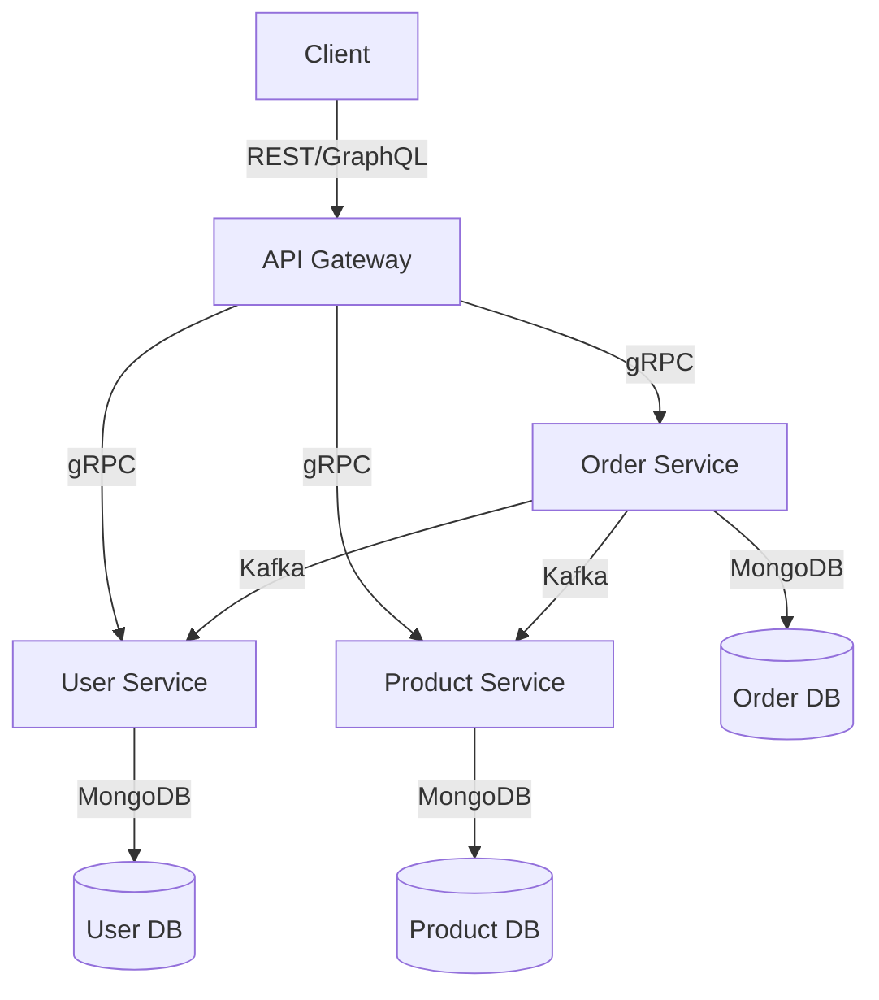

# E-Commerce Microservices Documentation

## Table of Contents

1. [Project Overview](#project-overview)
2. [System Architecture](#system-architecture)
3. [Technology Stack](#technology-stack)
4. [Project Structure](#project-structure)
5. [Setup & Installation](#setup--installation)
6. [API Documentation](#api-documentation)
7. [Testing](#testing)
8. [Future Roadmap](#future-roadmap)

## Project Overview

### Purpose

This e-commerce microservices project is designed to provide a scalable, maintainable, and high-performance online shopping platform. The system is built using a microservices architecture to ensure loose coupling, independent deployment, and better resource utilization.

### Core Functionality

- User authentication and authorization
- Product catalog management
- Order processing and management
- Real-time inventory tracking
- Secure payment processing

### Key Features

- GraphQL API for flexible data querying
- gRPC for high-performance service communication
- JWT-based authentication
- Rate limiting for API protection
- Event-driven architecture using Kafka
- MongoDB for data persistence

## System Architecture

### Architecture Diagram



### Communication Flows

1. **Client to Gateway**: REST/GraphQL requests
2. **Gateway to Services**: gRPC for internal communication
3. **Service to Service**: Kafka for event-driven communication
4. **Services to Database**: Direct MongoDB connections

### Data Flow

1. Client requests are received by the API Gateway
2. Gateway authenticates requests using JWT
3. Requests are routed to appropriate microservices
4. Services process requests and communicate via gRPC/Kafka
5. Data is persisted in MongoDB databases
6. Responses are returned to clients through the Gateway

## Technology Stack

| Component       | Technology         | Version | Purpose               |
| --------------- | ------------------ | ------- | --------------------- |
| API Gateway     | Apollo Server      | 4.12.0  | GraphQL API Gateway   |
| API Gateway     | Express            | 5.1.0   | HTTP Server           |
| User Service    | gRPC               | 1.13.3  | Service Communication |
| Product Service | gRPC               | 1.13.3  | Service Communication |
| Order Service   | gRPC               | 1.13.3  | Service Communication |
| Database        | MongoDB            | 8.14.1  | Data Persistence      |
| Authentication  | JWT                | 9.0.2   | Token-based Auth      |
| Security        | bcryptjs           | 3.0.2   | Password Hashing      |
| Message Broker  | Kafka              | 2.2.4   | Event Streaming       |
| API Security    | express-rate-limit | 7.5.0   | Rate Limiting         |

## Project Structure

```
ecommerce-microservices/
├── api-gateway/
│   ├── middleware/
│   ├── resolvers/
│   ├── routes/
│   ├── schema.js
│   └── server.js
├── user-service/
│   ├── models/
│   ├── user.proto
│   └── userMicroservice.js
├── product-service/
│   ├── models/
│   ├── product.proto
│   └── productMicroservice.js
├── order-service/
│   ├── models/
│   ├── order.proto
│   └── orderMicroservice.js
└── package.json
```

### Key Directories

- `api-gateway/`: GraphQL API Gateway implementation
- `user-service/`: User management microservice
- `product-service/`: Product catalog microservice
- `order-service/`: Order processing microservice
- `models/`: Database models and schemas
- `middleware/`: API Gateway middleware
- `resolvers/`: GraphQL resolvers
- `routes/`: API routes

## Setup & Installation

### Prerequisites

- Node.js (v14 or higher)
- MongoDB (v4.4 or higher)
- Kafka (v2.8 or higher)

### Environment Setup

1. Clone the repository
2. Install dependencies:

```bash
npm install
```

3. Create `.env` files in each service directory:

```env
# API Gateway
PORT=3000
JWT_SECRET=your_jwt_secret

# Product Service
PRODUCT_DB_URL=mongodb://localhost:27017/product
PRODUCT_SERVICE_PORT=50051

# Order Service
ORDER_DB_URL=mongodb://localhost:27017/order
ORDER_SERVICE_PORT=50052

# User Service
USER_DB_URL=mongodb://localhost:27017/user
USER_SERVICE_PORT=50053
```

### Database Initialization

Each service will automatically create its database schema on first run.

## API Documentation

### GraphQL Schema

The system exposes a GraphQL API with the following main types:

```graphql
type Product {
  id: ID!
  name: String!
  description: String!
  price: Float!
  stock: Int!
  category: String!
  createdAt: String
}

type Order {
  id: ID!
  userId: ID!
  items: [OrderItem!]!
  total: Float!
  status: String!
  createdAt: String
}

type User {
  id: ID!
  email: String!
  name: String!
  role: String!
  createdAt: String
}
```

### gRPC Services

Each microservice exposes gRPC endpoints:

#### Product Service

```protobuf
service ProductService {
  rpc GetProduct(GetProductRequest) returns (GetProductResponse);
  rpc SearchProducts(SearchProductsRequest) returns (SearchProductsResponse);
  rpc CreateProduct(CreateProductRequest) returns (CreateProductResponse);
  rpc UpdateProduct(UpdateProductRequest) returns (UpdateProductResponse);
  rpc DeleteProduct(DeleteProductRequest) returns (DeleteProductResponse);
}
```

### Error Codes

- 400: Bad Request
- 401: Unauthorized
- 403: Forbidden
- 404: Not Found
- 500: Internal Server Error

## Testing

### API Testing with Postman

#### User Service Endpoints

1. **Create User**

```http
POST http://localhost:50053/user/create
Content-Type: application/json

{
    "email": "test@example.com",
    "name": "Test User",
    "password": "password123",
    "role": "USER"
}
```


2. **Login User**

```http
POST http://localhost:50053/user/login
Content-Type: application/json

{
    "email": "test@example.com",
    "password": "password123"
}
```


#### Product Service Endpoints

1. **Create Product**

```http
POST http://localhost:50051/product/create
Content-Type: application/json

{
    "name": "Test Product",
    "description": "A test product description",
    "price": 99.99,
    "stock": 100,
    "category": "Electronics"
}
```


2. **Get Product**

```http
GET http://localhost:50051/product/get/{product_id}
```


#### Order Service Endpoints

1. **Create Order**

```http
POST http://localhost:50052/order/create
Content-Type: application/json

{
    "userId": "user_id_here",
    "items": [
        {
            "productId": "product_id_here",
            "quantity": 2,
            "price": 99.99
        }
    ],
    "total": 199.98
}
```


### GraphQL Testing with Apollo Sandbox

#### User Queries

```graphql
query GetUser {
  user(id: "user_id_here") {
    id
    email
    name
    role
    createdAt
  }
}
```


#### Product Queries

```graphql
query GetProducts {
  products {
    id
    name
    description
    price
    stock
    category
  }
}
```


#### Order Queries

```graphql
query GetOrders {
  orders(userId: "user_id_here") {
    id
    userId
    items {
      productId
      quantity
      price
    }
    total
    status
    createdAt
  }
}
```


### Test Data Setup

To run these tests, you'll need to:

1. Start all services
2. Create a test user and note the returned user ID
3. Create a test product and note the returned product ID
4. Use these IDs in subsequent requests

### Testing Best Practices

1. Always start with a clean test environment
2. Use unique test data for each test run
3. Clean up test data after testing
4. Test both successful and error scenarios
5. Verify response formats and status codes
6. Test authentication and authorization
7. Test rate limiting and security measures

## Future Roadmap

### Planned Enhancements

1. Implement caching layer using Redis
2. Add payment service integration
3. Implement real-time notifications
4. Add analytics service
5. Implement service mesh for better observability

### Technical Debt

1. Add comprehensive logging
2. Implement circuit breakers
3. Add more unit tests
4. Improve error handling
5. Add API versioning

### Scaling Considerations

1. Implement horizontal scaling for all services
2. Add database sharding
3. Implement CDN for static content
4. Add load balancing
5. Implement service discovery

## Security Considerations

1. All API endpoints are protected with JWT authentication
2. Rate limiting is implemented to prevent DDoS attacks
3. Passwords are hashed using bcrypt
4. Input validation is implemented at all layers
5. CORS is properly configured
6. Environment variables are used for sensitive data

## Getting Started Quick Guide

1. Start MongoDB:

```bash
mongod
```

2. Start Kafka:

```bash
kafka-server-start config/server.properties
```

3. Start all services:

```bash
# Terminal 1
node .\user-service\userMicroservice.js

# Terminal 2
node .\product-service\productMicroservice.js

# Terminal 3
node .\order-service\orderMicroservice.js

# Terminal 4
node .\api-gateway\server.js
```

4. Access the GraphQL playground at `http://localhost:3000/graphql`

## Architecture Decision Records

1. **GraphQL over REST**

   - Decision: Use GraphQL for API Gateway
   - Context: Need flexible querying and reduced over-fetching
   - Consequences: Better client experience, more complex server implementation

2. **gRPC for Internal Communication**

   - Decision: Use gRPC for service-to-service communication
   - Context: Need high-performance, type-safe communication
   - Consequences: Better performance, more complex setup

3. **MongoDB for Data Storage**
   - Decision: Use MongoDB for all services
   - Context: Need flexible schema and horizontal scaling
   - Consequences: Better scalability, eventual consistency
